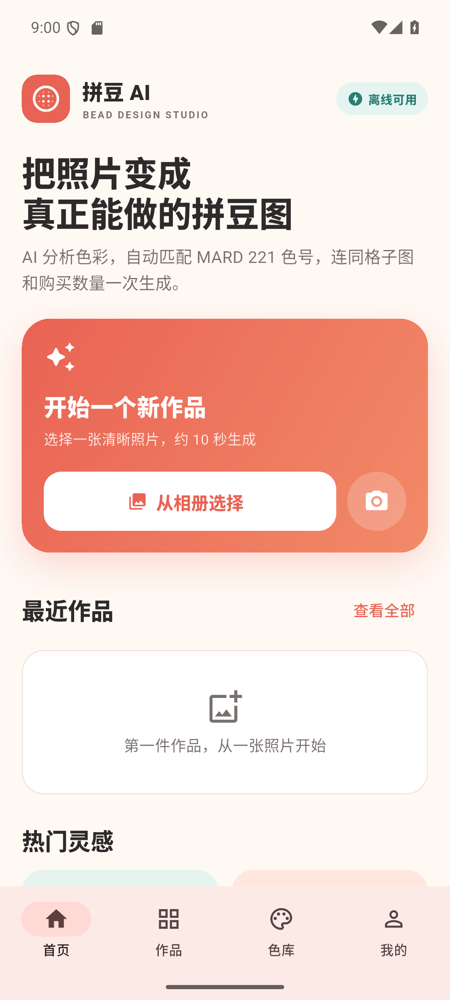
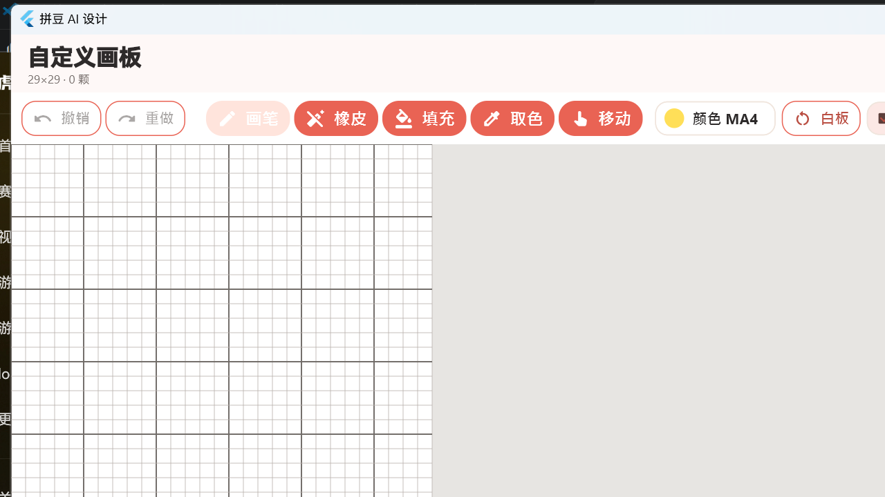
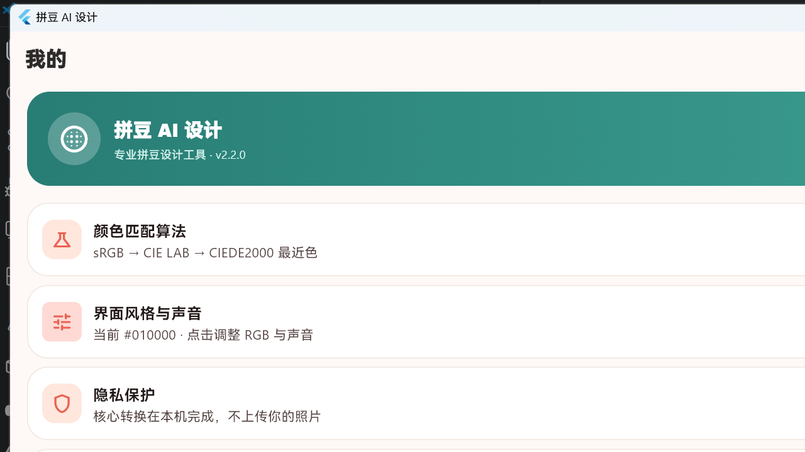
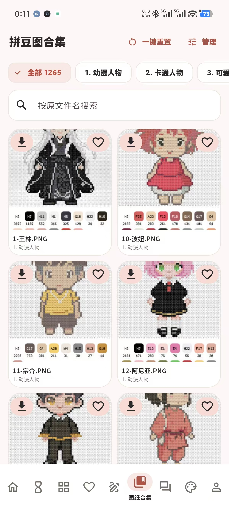
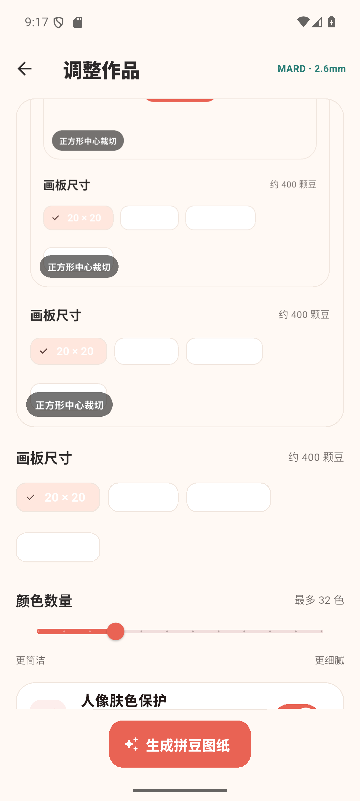
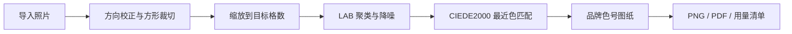

# 拼豆 AI 设计

<p align="center">
  <strong>把照片、文字和灵感，转换成真正能制作的拼豆图纸。</strong>
</p>

<p align="center">
  <a href="https://xuange6610.github.io/PindouAI/">在线参观</a> ·
  <a href="#快速开始">快速开始</a> ·
  <a href="#核心能力">核心能力</a> ·
  <a href="#技术原理">技术原理</a>
</p>

<p align="center">
  <a href="https://github.com/xuange6610/PindouAI/actions/workflows/pages.yml"></a>
  <a href="https://github.com/xuange6610/PindouAI/stargazers"></a>
  <a href="LICENSE"></a>
  
</p>



拼豆 AI 设计是一套离线优先的 Flutter 拼豆工作台。它把图片转换、品牌色号匹配、格子编号、用量统计、手动画板、作品管理和导出放进同一个流程；核心图片转换在本机完成，断网也能使用。AI 对话和云端能力是可选扩展，不影响基础制图。

搜索关键词：拼豆图纸、拼豆制作、拼豆图纸生成器、照片转拼豆、照片转像素画、拼豆色号匹配、拼豆色卡、Artkal 拼豆、MARD 拼豆、Perler beads、Hama beads、DIY 像素画、文字拼豆、拼豆画板、拼豆用量统计、拼豆 PDF 导出、拼豆 APK、拼豆 Windows 版、离线拼豆软件、bead pattern maker。

> 当前版本：`2.8.10+28`。项目由 xuan 维护。

## 在线参观

- [GitHub Pages 产品展示](https://xuange6610.github.io/PindouAI/)
- [完整使用 Wiki](https://github.com/xuange6610/PindouAI/wiki)
- [源代码仓库](https://github.com/xuange6610/PindouAI)
- [问题反馈](https://github.com/xuange6610/PindouAI/issues)

Pages 用于展示真实界面、工作流程和技术结构，不会在浏览器中上传或处理用户照片。

## 下载正式版

- [Android APK](https://github.com/xuange6610/PindouAI/releases/download/v2.8.10/PindouAI-Android-v2.8.10.apk)
- [Windows x64 安装程序](https://github.com/xuange6610/PindouAI/releases/download/v2.8.10/PindouAI-Windows-v2.8.10-x64-Setup.exe)
- [Android Lite APK（不含实体图纸）](https://github.com/xuange6610/PindouAI/releases/download/v2.8.10/PindouAI-Android-v2.8.10-Lite.apk)
- [Windows Lite 安装程序（不含实体图纸）](https://github.com/xuange6610/PindouAI/releases/download/v2.8.10/PindouAI-Windows-v2.8.10-x64-Lite-Setup.exe)
- [版本说明与校验值](https://github.com/xuange6610/PindouAI/releases/tag/v2.8.10)

完整 Android 与 Windows 包使用项目测试签名/安装程序，均内置 1265 张授权图纸；Lite 包不含实体图纸文件，仅保留核心制图和 4 个开源示例。图纸版权条款见 [ARTWORK_LICENSE.md](ARTWORK_LICENSE.md)。

## 核心能力

| 能力 | 实际作用 |
| --- | --- |
| 照片转图纸 | 选择图片、裁切、降采样并生成 20 到 200 格的拼豆作品 |
| 品牌色号匹配 | 通过 sRGB、CIE LAB、CIEDE2000 将每格映射到可查找的拼豆色号 |
| 多品牌色卡 | 浏览 Artkal、MARD、COCO、Perler、Hama 等色卡与颜色信息 |
| 自定义画板 | 画笔、橡皮、填充、取色和移动工具直接编辑格子 |
| 文字拼豆 | 把中文或其他文字渲染为像素化拼豆稿 |
| 作品与收藏 | 本地保存、分类、收藏、回收站、批量导入导出和换机备份 |
| 导出交付 | 导出预览图、圆形拼豆效果、编号格子图、PDF 和用量清单 |
| 可选 AI 工作流 | 接入兼容 API，进行 AI 制图、对话、历史管理和连接状态检查 |

## 真实界面

<table>
  <tr>
    <td width="50%"></td>
    <td width="50%"></td>
  </tr>
  <tr>
    <td align="center">自定义画板</td>
    <td align="center">算法、主题与隐私设置</td>
  </tr>
  <tr>
    <td width="50%"></td>
    <td width="50%"></td>
  </tr>
  <tr>
    <td align="center">1265 张图纸的分类、搜索与卡片浏览</td>
    <td align="center">画板尺寸、色数与生成参数</td>
  </tr>
</table>

## 快速开始

### 1. 准备环境

- 安装 [Flutter](https://docs.flutter.dev/get-started/install)，并确认 Dart SDK 满足 `pubspec.yaml` 中的版本要求。
- 安装 [Git LFS](https://git-lfs.com/)；仓库使用它保存随应用分发的中文字体。
- Windows 桌面版需要 Visual Studio 的 Desktop development with C++ 工作负载。
- Android 版需要 Android Studio、Android SDK 和可用的模拟器或真机。

### 2. 获取依赖

```bash
flutter pub get
```

### 3. 运行应用

```bash
# Windows
flutter run -d windows

# Android
flutter run -d android
```

### 4. 完成第一张图纸

1. 在首页选择一张清晰照片。
2. 调整裁切、画板尺寸、颜色数量和人像肤色保护。
3. 生成后检查真实色预览、编号格子和颜色用量。
4. 保存作品，或导出 PNG/PDF 后打印和备料。

## 技术原理



每个输出格都会映射到当前色卡中的一个颜色。转换结果、作品和导出默认保存在本机；只有用户主动配置并调用 AI 或云服务时，相关请求才会离开设备。

## 项目结构

```text
PindouAI/
├─ lib/                 Flutter 应用、算法、服务与界面
├─ test/                Flutter 单元和组件测试
├─ assets/              字体、开源示例与可选本地图集
├─ android/ ios/        移动端平台工程
├─ windows/ web/        Windows 与 Web 平台工程
├─ backend/             可选 FastAPI 服务
├─ ai-platform/         可选多模型工作台
├─ docs/                架构、PRD、测试报告与 Pages 展示站
└─ tool/                图集与开发辅助脚本
```

更详细的设计见 [产品需求](docs/PRD.md) 与 [技术架构](docs/ARCHITECTURE.md)。

## 可选服务

基础制图不依赖服务端。需要云能力时再按各目录说明启动：

```bash
docker compose -f backend/docker-compose.yml up --build
docker compose -f ai-platform/docker-compose.yml up --build
```

复制对应 `.env.example` 后自行创建 `.env`。真实密钥、数据库密码和签名文件不得提交到仓库。

## 构建与测试

```bash
flutter analyze
flutter test
flutter build windows --release
flutter build apk --release
```

构建产物保留在本机或 GitHub Release，不进入源码 Git 历史。iOS 发布还需要 Apple 开发者账号、签名证书和真机验收。

## 数据与版权边界

- 核心照片转换在本机完成，不会自动上传用户照片。
- 内置色值包含工程预置近似数据，不应冒充特定批次实体豆的实验室测量结果。
- Apache-2.0 许可证适用于本仓库原创源代码。
- 公开仓库只跟踪项目自行生成的 `sample_*.png` 和 `manifest.opensource.json`。维护者本地完整图集与用户导入内容具有各自权利归属，不因用于本应用而自动获得 Apache-2.0 授权。
- 1265 张高清图纸原图和对应预览由 xuan 确认拥有本次公开分发授权，通过 Git LFS 纳入仓库并内置于 Android、Windows 正式包。它们不适用 Apache-2.0，具体条款见 `ARTWORK_LICENSE.md`。
- 品牌名称仅用于色号兼容说明，相关商标属于各自权利人。

## 参与维护

欢迎通过 Fork 和 Pull Request 改进项目。提交前请阅读 [CONTRIBUTING.md](CONTRIBUTING.md)，并至少运行与改动范围匹配的分析和测试。

## 许可证与联系

源代码采用 [Apache License 2.0](LICENSE)，版权所有 © 2026 xuan。第三方素材不在该许可证的自动授权范围内。

- QQ：2590813506
- 微信：love_020804
